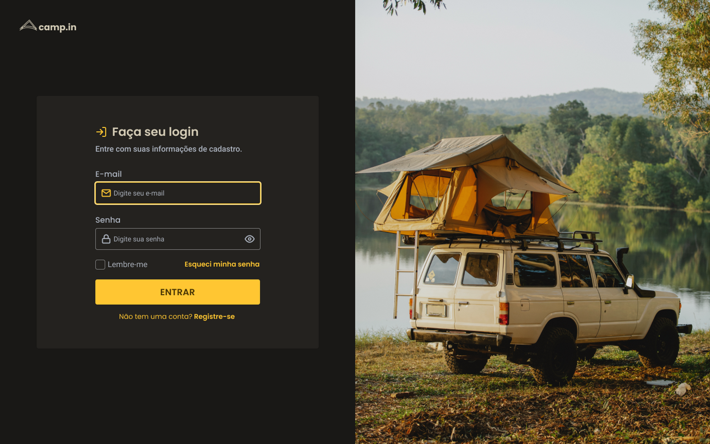

<h1 align="center"> Login Form </h1>

Login Form é um projeto desafio proposto pela <a href="https://www.rocketseat.com.br/">Rocketseat</a>, no qual consiste em criar um formulário de login (como na imagem abaixo). 

  

 

## 🚀 Tecnologias

Esse projeto foi desenvolvido com as seguintes tecnologias:

- HTML e CSS
- JavaScript
- Git e Github
- Figma

## 💻 Projeto

- [Visite o projeto online](https://theusmm.github.io/login-form/)

## 🔖 Layout

Você pode visualizar o layout do projeto através [DESSE LINK](https://www.figma.com/file/SX8XFyC5fAY09ai8Oykz0T/DD-%2F-Login-Form---CSS/duplicate). É necessário ter conta no [Figma](https://figma.com) para acessá-lo.

Feito com ♥ by Matheus MM. :wave: